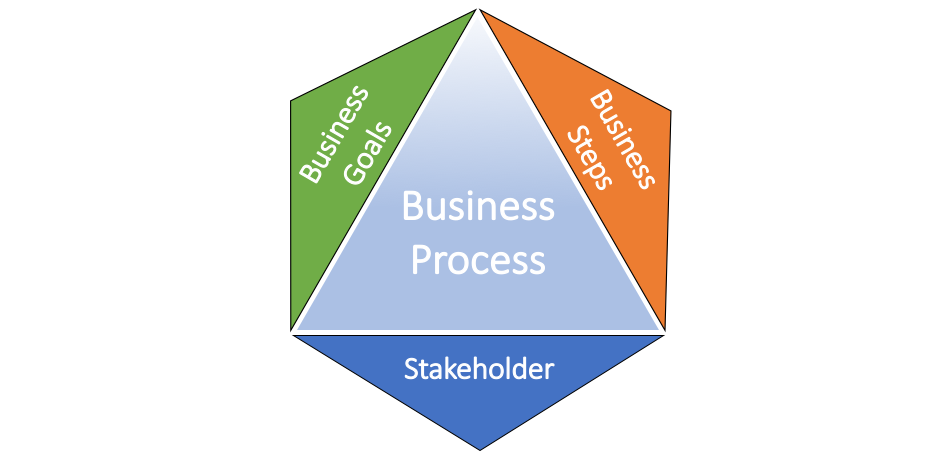

# Intelligence Business Process Automation

A business process is a set of tasks that will accomplish a specific organizational goal. These set of activities and tasks, once completed, will deliver a service or product to the client. The process involves clearly defined inputs and a single output.  These inputs are made up of all of the factors which contribute to the added value of an output, i.e., service or product.

### RPA

Robotic Process Automation (RPA), as the name implies automates the process with the intent of reducing human effort in continuous repetitive tasks.

RPA is outshining nowadays due to its functionality, accuracy, efficiency, and robustness in the optimization of the business process. By automating the repetitive task company employee can be involved in more productive task rather than doing the work which requires minimum human energy and innovation.

**Robotics Process Automation is very capable, some of the sample use case are mentioned below:**

- when receiving data from multiple sources or applications and storing it in one place.
- when sending data to various user or applications.
- rule-based or repetitive task based on policy.
- when the process is simple but too lengthy to perform.
- when the process is very complicated but short, and pronto human error.

Robotic Process Automation (RPA) is a structured automation process if we can create a flowchart or an algorithm of the business process than it can also be automated with the help of automation tool. RPA is a platform independent that means it can automate Desktop based application as well as browser-based application. If we talk about automation of business process, there is no doubt RPA on the top.

**There are multiple tools for RPA implementation like:**
- Automation Anywhere
- Blue Prism
- Ui Path
- Soft Motive
- Pega
- Work Fusion
- NICE

However, the majority of the market is captured by UI Path, Automation Anywhere and Blue Prism. Blue Prism is a Desktop based tool and is very good in automating back-end applications on the other hand UI Path is a robust tool with a lot of inbuilt capabilities.

In terms of flexibility, UI Path takes the advantage, but if we talk about security Blue Prism is best in the market. Most of the RPA tools are based on .Net architecture. In Blue Prism we can use C#, J#, and Visual Basic while in UI path we have to use Visual Basic.

**UI Path consists of  "three " major parts:**

  - **Studio**: The studio is the place where we can do the development and customize our code as per business requirements.

  - **Robot**: The robot is used to run the code on specific machines while which code has to run on which machine at what time is all done by UI Path

  - **Orchestration**: UI Path orchestrator is a web-based application, i.e., multiple bots(machines) have to be connected to the single Orchestrator.

In simple term, RPA is automating the process with the help of using pseudocode, flowchart,  and sequence. We are not concerned about the code which tool generates at its backend. However to gain expertise in RPA its best to have knowledge of the following topics -

- HTML
- XML
- Database
- Web services
- OOPs

RPA is like the hands and feet of the human body, capable of doing things but can't make decisions. To make the intelligent choice, we require a brain, and this is where Artificial Intelligence comes in the picture. With the help of machine learning and deep learning, we can create intelligent bots which can act like a human and take a decision on your behalf.

### Machine learning

Machine Learning is a set of algorithms that read data, learn from it, and then apply what they’ve learned to make intelligent decisions.

Most machine learning methods often categorized as supervised learning or unsupervised learning, but now there is two more categories know as Semi-supervised and reinforcement learning.

*   **Supervised learning** algorithms work with labelled data and can be used to predict future events based on that data. During training, the machine learning algorithm produces an inferred function to make predictions about the target value. After training, the system is capable enough to provide targets for any new input.

*   **Unsupervised learning** algorithms are used when the information used to train is not labelled. It infers a function to describe a hidden structure from unlabelled data. The algorithm doesn’t figure out the right output, but it explores the data and can draw inferences from datasets to describe hidden structures from unlabelled data.

### Cognitive Services

- What is cognitive service?
- What cognitive service Ui Path provide?

### RPA and Python

With the increasing market for RPA, every RPA company is starving for developing an intelligent solution for their customers, and to do so, they need to design the brain of the bot. As an obvious choice for the integration companies decided to go with Python an open source programming language which supports multiple machine learning/deep learning libraries.

Ui Path provides integration with Python `Python scope`  which can be used to integrate any python logic with UI Python bot. Integration is straightforward given that we follow some simple standards during our python code and UI Path definition.

> Note: As of now Ui Path (v2018.2.3) support Python 3.x (32-bit).

  - Python
    - For easy installation of Python use [Anaconda]() 32-bit version, the reason being it conda package manager as well as all required python libraries.
    - While writing code, don't use the absolute path of the file in Python code for reading/ writing.
    - Don't use single quotes `'` in Python code.

- Ui Path
    - To integrate Python/Conda use root path of the installation folder.
